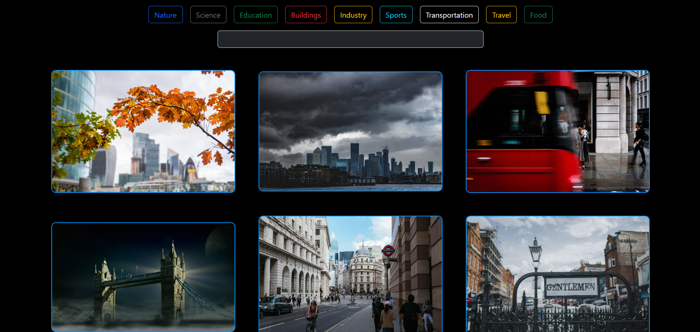
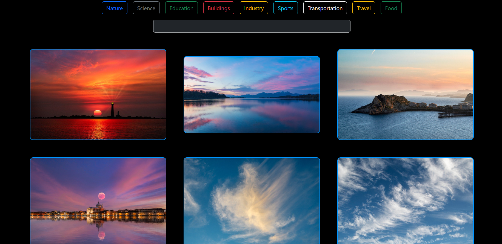

# React + Vite

This template provides a minimal setup to get React working in Vite with HMR and some ESLint rules.

Currently, two official plugins are available:

- [@vitejs/plugin-react](https://github.com/vitejs/vite-plugin-react/blob/main/packages/plugin-react) uses [Babel](https://babeljs.io/) for Fast Refresh
- [@vitejs/plugin-react-swc](https://github.com/vitejs/vite-plugin-react/blob/main/packages/plugin-react-swc) uses [SWC](https://swc.rs/) for Fast Refresh

## Expanding the ESLint configuration

If you are developing a production application, we recommend using TypeScript with type-aware lint rules enabled. Check out the [TS template](https://github.com/vitejs/vite/tree/main/packages/create-vite/template-react-ts) for information on how to integrate TypeScript and [`typescript-eslint`](https://typescript-eslint.io) in your project.

# 📸 Pixabay Clone - React App

Welcome to **Pixabay Clone**, a React-based web app that mimics the core features of the popular image source platform **Pixabay**! 🖼️✨  
You can search, browse, and explore beautiful royalty-free images powered by the official **Pixabay API**.

🔗 **Live Demo**: [View on Vercel](https://pixabay-clone-react-blue.vercel.app/)

---

## 🚀 Features

- 🔍 **Live Image Search** powered by the Pixabay API
- ⚛️ **React Functional Components** with Hooks
- 🧠 **Context API** for global state management
- 🎯 Clean and minimal UI using modern CSS
- 📱 Fully Responsive Design
- 💡 Handles loading and empty search results elegantly

---

## 🛠️ Tech Stack

- ⚛️ **React.js**
- 🌐 **Pixabay API**
- 🎨 **CSS**
- 🔄 **React Context API**
- ☁️ **Vercel** for deployment

---

## 📁 Folder Structure

pixabay-clone/ │ ├── public/ ├── src/ │ ├── components/ │ ├── context/ │ │ ├── PixabayContext.jsx │ │ └── PixabayState.jsx │ ├── App.jsx │ └── index.js ├── README.md └── package.json

---

## 💻 Getting Started

Follow these steps to set up the project locally and make your own improvements 🔧

### 1. **Clone the Repo**

git clone https://github.com/yourusername/pixabay-clone.git
cd pixabay-clone
2. Install Dependencies
bash
Copy
Edit
npm install
3. Add Your Pixabay API Key
Inside PixabayState.jsx, replace the API key line with your own key from Pixabay Developer:

js
Copy
Edit
const api_key = "YOUR_PIXABAY_API_KEY";
4. Run the App
bash
Copy
Edit
npm run dev
✏️ How to Contribute or Modify the Project
🔃 Fork the repository on GitHub

🛠️ Make changes to your forked repo

✅ Test your changes locally

📩 Create a pull request describing your edits

📸 Screenshots
(Add screenshots here of your app interface or a short GIF preview)

👩‍💻 Author
Made with 💙 by Pallavi Acharya
LinkedIn | Portfolio

📬 Contributions & Feedback
Found a bug or have an idea to improve?
Feel free to open an issue or submit a pull request – contributions are always welcome! 🫶

